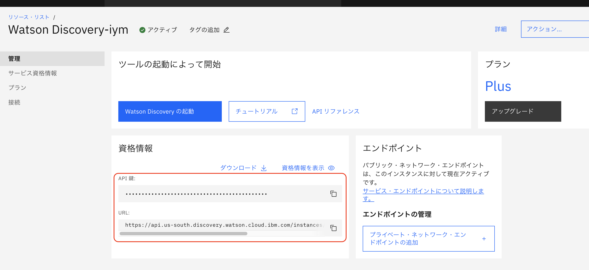
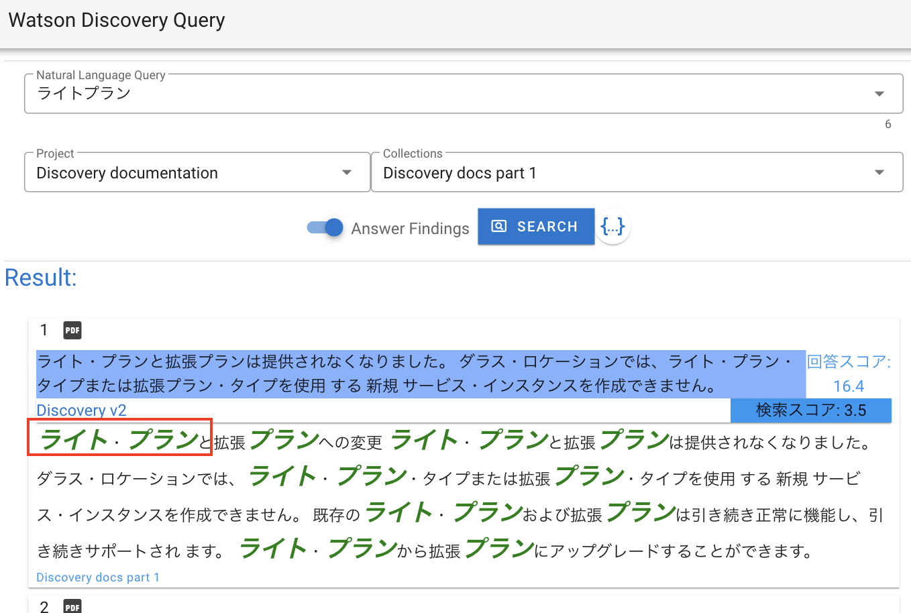

# Watson Discovery Build Assets

* [サービスのマニュアルはこちら](https://cloud.ibm.com/docs/discovery-data?topic=discovery-data-getting-started)

## IBMCloud WatsonDiscovery のリソース情報
* "資格情報を表示" を押し "apikey","url" をメモしておく
  <div>
    
  </div>

## サンプルアプリ環境概要
  

## 使用しているJavaScriptライブラリ
* [Vue.js](https://jp.vuejs.org/v2/guide/) 2系
* [Vuetify](https://vuetifyjs.com/ja/getting-started/installation/)

## 開発ツールのインストール
* [Node.jsとnvmのインストール](https://kazuhira-r.hatenablog.com/entry/2021/03/22/223042)
  * "node -v", "npm -v" コマンドを確認

## プロジェクトのセットアップ
### ソースのダウンロード
* Gitからソース一式をクローン、or zipファイルダウンドード
```
 "wd_bridge_api.zip" ファイルを展開
```

### プロジェクトのファイルをインストール
* 展開したソースのディレクトリに "cd"してからインストールを実行
```
"cd ./wd_bridge_api"
npm install
```
* "package.json"ファイルのあるフォルダ内で上記を実行
* "package.json" 記載のモジュールが "node_modules"配下に展開される

* エラーがでる場合はクリーンしてから実行
```
npm cahce clean --force
rm -rf node_modules
```

## 開発手順
### Discoveryのサービス情報をセットする
  * 展開したフォルダ内で ".env_sample"ファイルを ".env"ファイルにコピーする
  * IBMCloudのDiscoveryのサービス情報を貼り付ける
    * apikey, url
      <div>
        
      </div>

### Discoveryサービスとの中継サーバを起動しコンテンツの動作を確認
```
node server.js
```
* 起動成功で "http://localhost:3000/index.html" でローカルサーバのコンテンツが表示される
  <div>
    
  </div>
* Chromeで上記URLを開いて F12等から デベロッパーツールを開く
  <div>
    
  </div>
* [Search]ボタンを押す
  * コンテンツ側でレスポンスを確認する
    <div>
      
    </div>
* プロジェクトIDを選択
  * ".env"で指定したURLからインスタンスのプロジェクトIDが表示されている
    <div>
      
    </div>
* 検索対象のコレクションIDを選択
  * Query検索に使用するコレクションIDを選択する
  * 複数選択可能
  * プロジェクトIDを変更すると一覧を取得する
    <div>
      
    </div>
* AnswerFindingsで検索
  * Query検索に使用するオプションを変更する
    <div>
      
    </div>
  * 送信パラメータを確認する
    <div>
      
    </div>
  * 検索結果に回答の結果が含まれる
    <div>
      
    </div>

## アプリケーションのカスタマイズ
  * ハイライト表示
    * 検索結果の本文 "document_passages[0].passage_text"
      * "emタグ"で強調表示部分が囲われている
      <div>
        
      </div>
    * "index.html"内のCSSを変更する
      <div>
        
      </div>
    * 表示に反映される
    <div>
      
    </div>

## 続く
### [コンテナサービスへのデプロイ](./doc/ce/deploy_codeengine.md)
### [CSVデータ取り込みのカスタマイズ](./doc/csv/csv_import.md)
