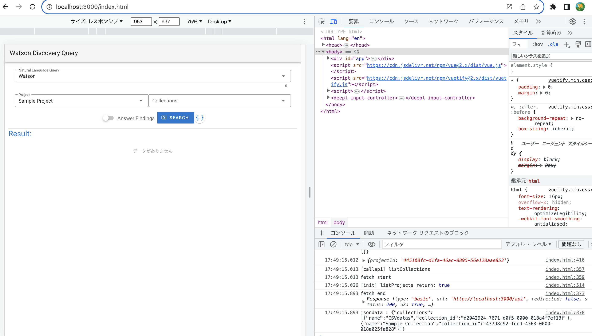

# CodeEngine移植

## Webアプリの移植手順
* コンテナ化されたNode.jsで実装したWebサーバ
  * https://github.com/iymh/wd_bridge.git
    * ExpressでRESTサーバ実装
    * DiscoveryV2APIでWatsonDiscoveryからデータ取得
    * 簡易的な認証(BasicAuth)を実装(テスト実装)
    * 環境変数でパラメータ値が必要
      * API_KEY: WatsonDiscoveryのAPI鍵
      * API_BASE_URL: WatsonDiscoveryのエンドポイントURL
        

## 動作確認
* GETで確認
  * ブラウザ画面テスト文字列が表示される
    

* POSTで確認
  * [URL]/api
    

* Main.vue 画面構成

  

