# Watson Discovery Build Assets

## CodeEngine環境

  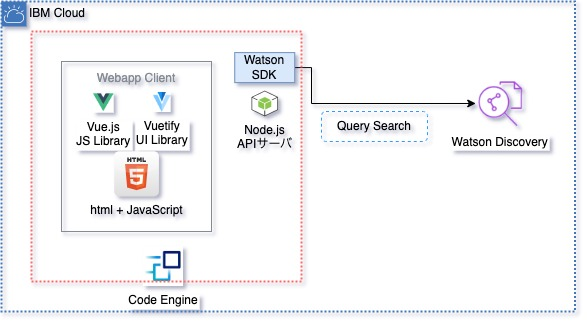

### Webアプリの概要
* コンテナ化されたNode.jsで実装したWebサーバ
  * ExpressでRESTサーバ実装
  * DiscoveryV2APIでWatsonDiscoveryからデータ取得
  * 簡易的な認証(BasicAuth)を実装(テスト実装)
  * 環境変数でパラメータ値が必要
    * API_KEY: WatsonDiscoveryのAPI鍵
    * API_BASE_URL: WatsonDiscoveryのエンドポイントURL

### 設定
  * CodeEngineにプロジェクトを作成してアプリケーション一覧を表示する
    

      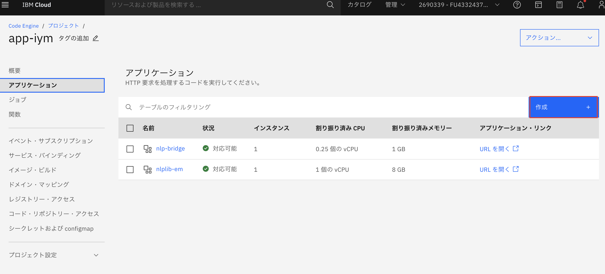
    

  * アプリケーションの情報を入力する
    * "名前"
    * "実行するコードの選択" > "ソース・コード"
      * "ソース・コードURL" > "https://github.com/iymh/wd_bridge_api"
    * "ビルド詳細の設定"ボタンを押す
    

      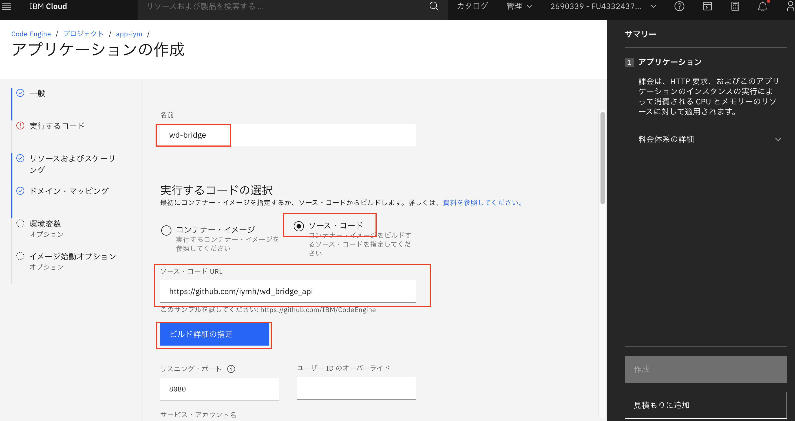
    

  * ビルド情報を入力する
    * "Dockerfile" > Dockerfile
      * "Buildpack"でも可能だがコンテナサイズが肥大化してしまう
    * "レジストリー・サーバー" > "private.jp.icr.io"
    * "名前空間" > Container Registryリソースを作成しておく
    

      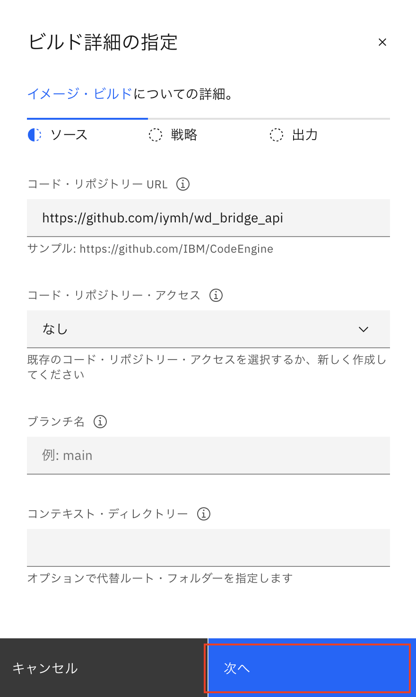
      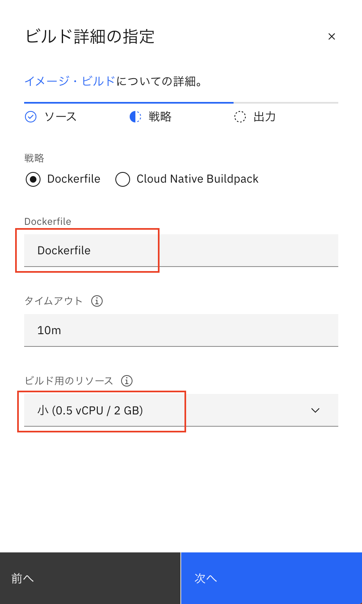
      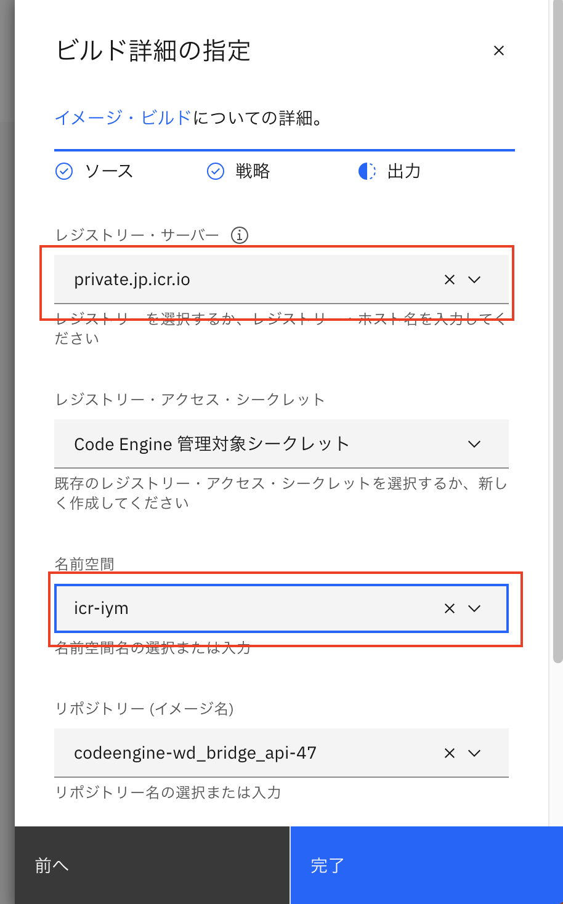
    

  * ビルド情報が反映されていることを確認
    * "リスニング・ポート" > "3000"
      * ".env"ファイル内で指定したPort番号を指定する
    

      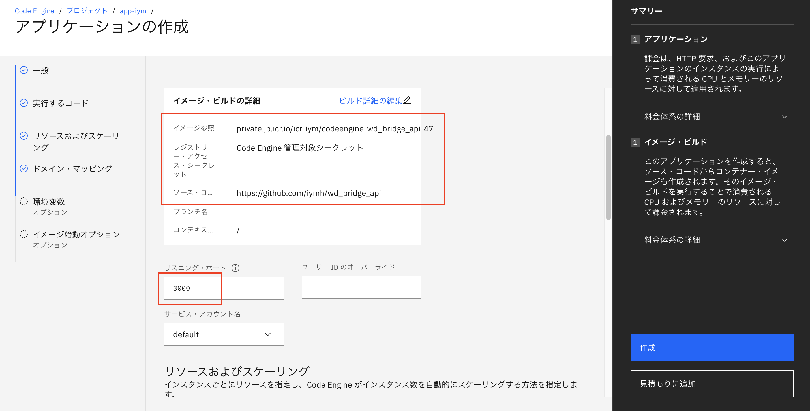
    

  * コンテナインスタンスのサイズを指定する
    * "CPUおよびメモリー" > 小さめのもので動作可能
    * "インスタンスの最小数" > 1
      * ここを0にするとコールドスタート可能になるが、起動に30秒程かかる
      * コンテナの課金に合わせて変更する
    

      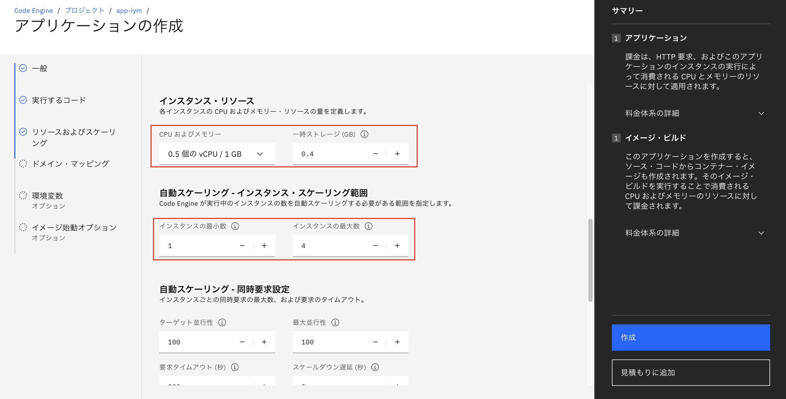
    

  * 環境変数を設定する
    * ".env"ファイル内で指定した値を入力する
      * API_KEY
      * API_BASE_URL
    

      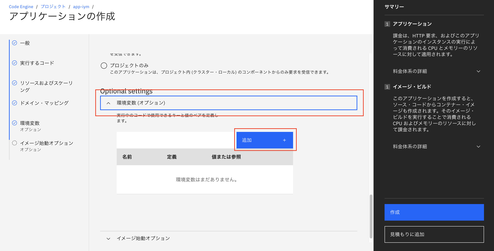
    

    

      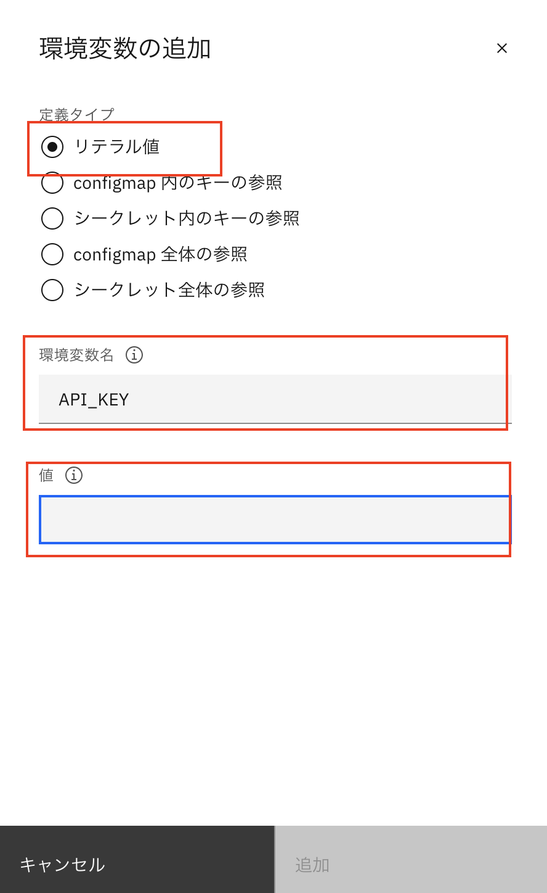
    

  * 環境変数が設定されていることを確認して"作成"ボタンを押す
    

      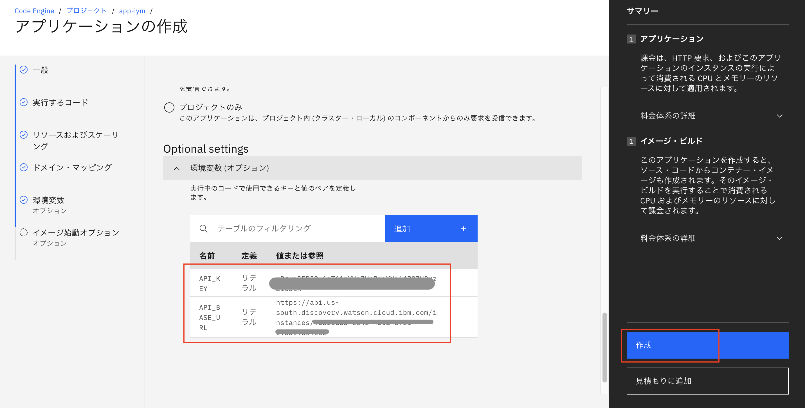
    

  * コンテナのデプロイが完了するとインスタンスの実行状態が表示される
    

      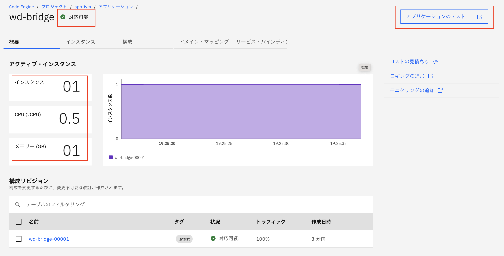
    

  * "アプリケーションのテスト"より外部URLを確認する
    

      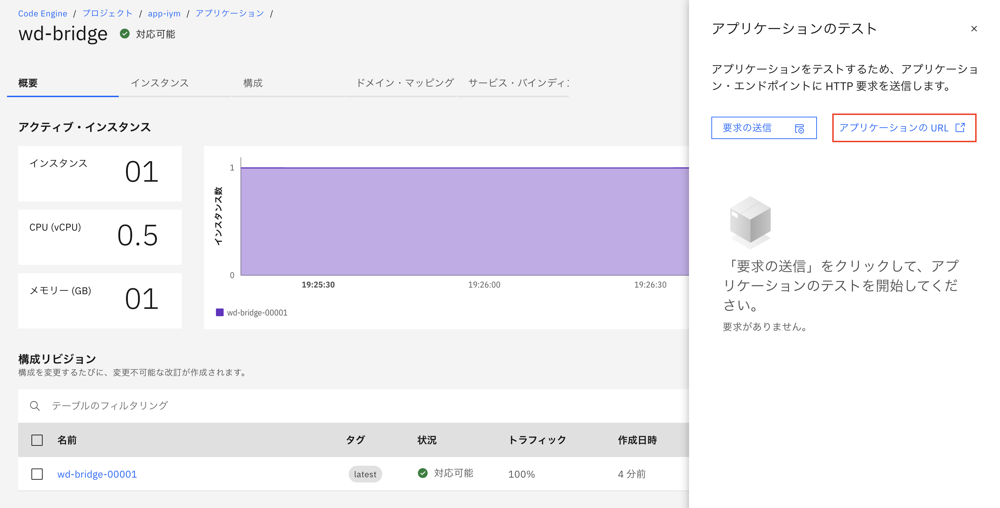
    

  * 外部URLにデプロイされていることを確認する
    

      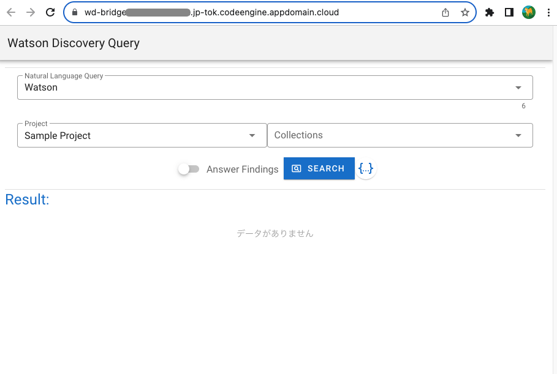
    

