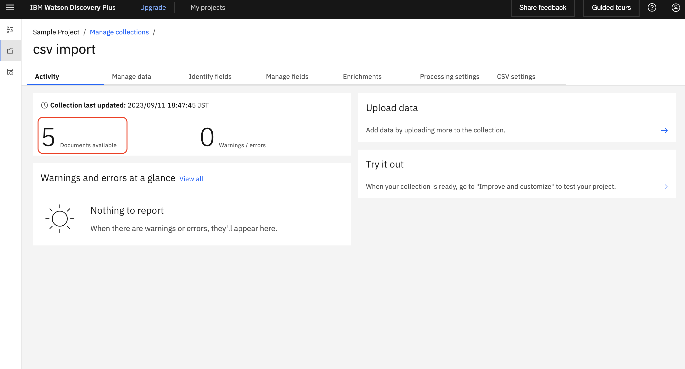
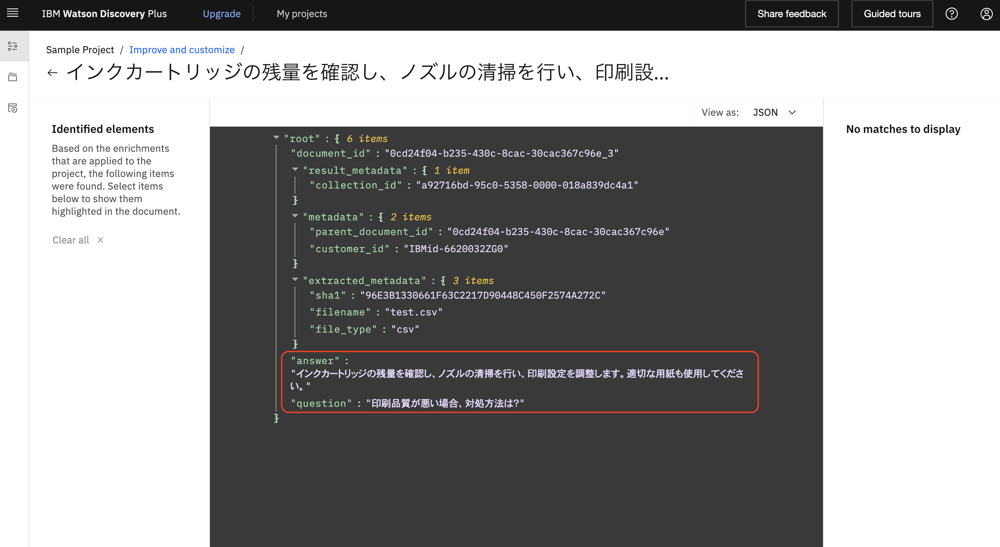

# Watson Discovery Build Assets

## CSVデータをデータ検索に使用するためのカスタマイズ
  * 使用するCSVデータのタイトル部を決定する
    * "qustion", "answer"がJSONフィールド名に使用されます
    

      
    

## Discovery側設定
  * 新規コレクションを作成する
    

      
    

  * アップロードデータを選択する
    

      
    

  * コレクション名を指定する
    * "csv import" で作成
    

      
    

  * CSVファイルをアップロードする
    

      
    

  * 作成されたコレクションの管理画面を表示する
    

      
    

  * データ解析状況が完了になるまで待つ
    * "document processing" -> "document available"
    

      
      
    

  * 取り込み済みドキュメントを確認する
    * サンプルCSVファイルの５行が5件ドキュメントとして登録される
    

      
    

  * フィールド名を変更して値を表示する
    * "question", "answer"を選択する
    

      
    

  * 一覧に表示されていることを確認する
    

      
    

  * "Enrichments"タブで選択状態を全て未選択にする
    * 今回はエンティティ抽出やキーワード抽出は使用しない
    * ここの設定はJSONフィールドの出力値に影響する
      * "question","answer"はテキストで返却される
    

      
    

### Discoveryの画面で検索
  * 「印刷品質悪い」で検索してみる
    * 項目が表示されない
    

      
    

  * 表示設定を変更する
    * "Search results"
    

      
    

  * 上段に"answer", 下段に"question"を表示する
    

      
    

  * 検索結果の詳細を確認する
    * 青字の"View document"のリンクを押す
    * "Open advanced view"ボタンを押す
    

      
    

  * 表示データをJSONデータに変更する
    * "View as:"を "JSON"に変更
    * "question", "answer"フィールドに値が返却されていることを確認
    

      
    

### サンプルコンテンツのソースを修正
  * "setResultTable"の関数内でJSONデータのフィールド値を追加する
    * この処理はDiscoveryから取得したJSONデータから画面表示に使用するものだけをセットしている
    

      
    

  * 画面に表示する箇所に追加する
    

      
    

### ブラウザでコンテンツを確認
  * CSVをインポートしたコレクションを選択する
    

      
    

  * 「キーワード」で検索すると検索結果が表示される
    

      
    

