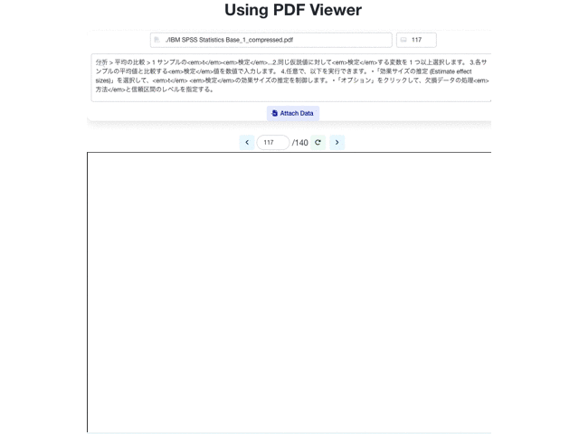
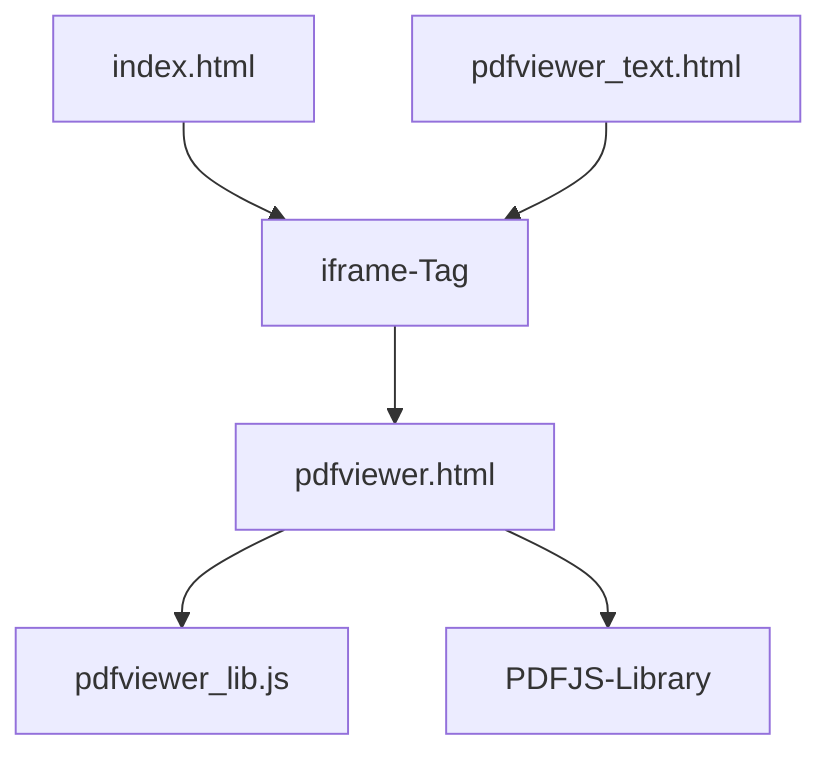

# Watson Discovery Build Assets

## PDFファイルのプレビュー表示
  * WatsonDiscoveryから取得したハイライトの情報をPDF上に描画する
    * PDFJSライブラリ(ReusableComponentと同じ)を使用
    * Canvasタグ上にHTMLのDivタグで半透明の矩形をレイヤー表示
    * WDからのTextMappingの情報でページNoを取得
    * WDでドキュメント分割されているとハイライトのoffset情報が取れない問題がある
      * PDFページを検索してPassageテキストと比較して該当箇所を検索することで実現
    

      
    

### 構成

## サンプルコンテンツにPDFファイルのプレビュー表示
  * 実際に機能実装したサンプル画面
    

      
    

## 課題
  * WDのTextMappingsとオープンソースのPDFJSライブラリでPDFテキストの持ち方が違う
    * 文字列の区切り方が異なるので、ハイライトのための検索精度が悪くなる